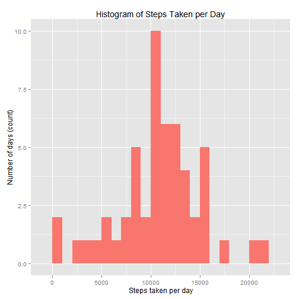

```
## Error in setwd("L:/R/Courses/JHU - 5 Reproducible Research/Peer_assesment_1"): cannot change working directory
```

***
## Overview

This document represents the assignment for Reproducible Research course in Johns Hopkins University Data Specialization track. The objective for this assignment is to create a simple reproducible report created as a single markdown document by analyzing data gathered from one person wearing a personal activity monitoring device and then answering few questions about the data as stated in the assignment.

This device collects data at 5 minute intervals through out the day. The data consists of two months of data from an anonymous individual collected during the months of October and November, 2012 and include the number of steps taken in 5 minute intervals each day.

***
## Data

The dataset for this assignment is provided via a Github repository for this assignment and is stored in a comma-separated-value (CSV) file and there are a total of 17,568 observations in this dataset.


The variables included in the dataset are:

steps: Number of steps taking in a 5-minute interval (missing values are coded as NA)

date: The date on which the measurement was taken in YYYY-MM-DD format

interval: Identifier for the 5-minute interval in which measurement was taken (ie. interval 1355 equals to time 13:55)

***
## Analyzing the data

### Loading the dataset

Load the given dataset from a .zip file and casting the date column into a Date datatype. It is assumed that zip file is already contained in working directory, otherwise you can downloaded file here:

[Activity monitoring data](https://d396qusza40orc.cloudfront.net/repdata%2Fdata%2Factivity.zip)


```r
activity <- read.table(unzip("./Activity.zip", exdir=".", overwrite=TRUE), header=TRUE, sep=",")
```

### Install packages and load libraries needed for the analysis


```r
if (!require("dplyr")) {
    install.packages("dplyr")
}
```

```
## Loading required package: dplyr
## 
## Attaching package: 'dplyr'
## 
## The following object is masked from 'package:stats':
## 
##     filter
## 
## The following objects are masked from 'package:base':
## 
##     intersect, setdiff, setequal, union
```

```r
library(dplyr)
if (!require("ggplot2")) {
    install.packages("ggplot2")
}
```

```
## Loading required package: ggplot2
```

```r
library(ggplot2)
if (!require("lubridate")) {
    install.packages("lubridate")
}
```

```
## Loading required package: lubridate
```

```r
library(lubridate)
```

### Preprocessing data

Here's a sample of raw data:


```r
head(activity)
```

```
##   steps       date interval
## 1    NA 2012-10-01        0
## 2    NA 2012-10-01        5
## 3    NA 2012-10-01       10
## 4    NA 2012-10-01       15
## 5    NA 2012-10-01       20
## 6    NA 2012-10-01       25
```

Note that the interval variable has a notation in a hhmm format, but for this report we don't need to transform it to time data type since all analysis we'll be done in respect to given intervals or days. For this purpose we will cast the **date** variable into Date datatype and **interval** variable into Factor datatype.


```r
activity$date <- as.Date(activity$date)
```

After cleaning the dataset this is what we have (we use **dplyr** library for a nicer representation of data and later for summarization):


```r
activity <- tbl_df(activity)
str(activity)
print(activity)
```

```
## Classes 'tbl_df', 'tbl' and 'data.frame':	17568 obs. of  3 variables:
##  $ steps   : int  NA NA NA NA NA NA NA NA NA NA ...
##  $ date    : Date, format: "2012-10-01" "2012-10-01" ...
##  $ interval: int  0 5 10 15 20 25 30 35 40 45 ...
## Source: local data frame [17,568 x 3]
## 
##    steps       date interval
## 1     NA 2012-10-01        0
## 2     NA 2012-10-01        5
## 3     NA 2012-10-01       10
## 4     NA 2012-10-01       15
## 5     NA 2012-10-01       20
## 6     NA 2012-10-01       25
## 7     NA 2012-10-01       30
## 8     NA 2012-10-01       35
## 9     NA 2012-10-01       40
## 10    NA 2012-10-01       45
## ..   ...        ...      ...
```

### What is mean total number of steps taken per day?

For this part of the assignment we will ignore the missing values in the dataset.

We need to:

    1. Make a histogram of the total number of steps taken each day
    2. Calculate and report the mean and median total number of steps taken per day


```r
total_steps_per_day <- aggregate(steps ~ date, data = activity, FUN = sum)
head(total_steps_per_day)

qplot(steps, data = total_steps_per_day, binwidth = 1000, fill = "salmon", main = "Histogram of Steps Taken per Day", xlab = "Steps taken per day", ylab = "Number of days (count)") + guides(fill=FALSE)
```

 

```
##         date steps
## 1 2012-10-02   126
## 2 2012-10-03 11352
## 3 2012-10-04 12116
## 4 2012-10-05 13294
## 5 2012-10-06 15420
## 6 2012-10-07 11015
```

We calculate mean and median total number of steps taken every day:


```r
mean_steps_per_day <- mean(total_steps_per_day$steps, na.rm = TRUE)
median_steps_per_day <- median(total_steps_per_day$steps, na.rm = TRUE)
```

**Mean** total number of steps taken per day is 10766.19 and **median** is 10765.

### What is the average daily activity pattern?

Here we need to calculate number of steps for each interval (period of the day) and average it across all the days, then make a time series plot of the 5-minute interval (x-axis) and  the average number of steps taken, averaged across all days (y-axis). Next, we need to report which 5-minute interval contains the maximum number of steps.


```r
mean_steps_per_interval <- aggregate(activity$steps, by = list(interval = activity$interval), FUN = mean, na.rm = TRUE)
names(mean_steps_per_interval) <- c("interval", "steps_per_interval")
summary(mean_steps_per_interval)
```

```
##     interval      steps_per_interval
##  Min.   :   0.0   Min.   :  0.000   
##  1st Qu.: 588.8   1st Qu.:  2.486   
##  Median :1177.5   Median : 34.113   
##  Mean   :1177.5   Mean   : 37.383   
##  3rd Qu.:1766.2   3rd Qu.: 52.835   
##  Max.   :2355.0   Max.   :206.170
```

We'll make the time series plot for each 5-minute interval, but we'll convert the interval values to periods in the day for easier understanding.


```r
ggplot(data = mean_steps_per_interval, aes(x = interval, y = steps_per_interval)) +
    geom_line(color = "steelblue", size = 1.2) +
    labs(title="Average Daily Activity Pattern", x = "Period of the day (interval)", y = "Number of steps taken") 
```

 

### Which 5-minute interval, on average across all the days in the dataset, contains the maximum number of steps?


```r
max_steps_interval <- mean_steps_per_interval[which.max(mean_steps_per_interval$steps),]
```

Interval 835 has a maximum averaged value of 206.17 steps taken in that interval during all days, which corresponds to morning period between 8:35-8:40. 

### Imputing missing values

We need to solve the problem of missing values in the dataset by devising a strategy for filling in the missing data.


```r
NAs <- length(activity[is.na(activity)])
```

Number of missing values in original dataset is 2304 and they are exclusively missing for **steps** variable.

We'll fill in the missing values in steps variable by using the mean value calculated for each interval.


```r
activity_filled_NAs <- activity[, 1:3]
activity_filled_NAs$steps[is.na(activity$steps)] <- with(activity, ave(steps, interval, FUN = function(x) round(mean(x, na.rm = TRUE), 2)))[is.na(activity$steps)]
```

We'll verify that there are no more missing values in the dataset.


```r
length(activity_filled_NAs[is.na(activity_filled_NAs)])
```

```
## [1] 0
```

OK, there are no more missing values, so now we make the histogram of the total number of steps taken each day again, but this time with imputed values for missing ones.


```r
mean_steps_per_interval_new <- aggregate(activity_filled_NAs$steps, by = list(interval = activity_filled_NAs$interval), FUN = mean, na.rm = TRUE)
names(mean_steps_per_interval_new) <- c("interval", "steps_per_interval")

ggplot(data = mean_steps_per_interval_new, aes(x = interval, y = steps_per_interval)) +
    geom_line(color = "mediumpurple1", size = 1.2) +
    labs(title="Average Daily Activity Pattern after populating the missing values", x = "Period of the day (interval)", y = "Number of steps taken")
```

 

New mean and median total number of steps taken every day corrected for missing values:


```r
total_steps_per_day_new <- aggregate(steps ~ date, data = activity_filled_NAs, FUN = sum)
mean_steps_per_day_new <- mean(total_steps_per_day_new$steps)
median_steps_per_day_new <- median(total_steps_per_day_new$steps)
```

Now, the **mean** total number of steps taken per day is 10766.18 and **median** is 10766.13.

### Do these values differ from the values we calculated in the first part of the assignment?

Let's compare the means and medians before and after we filled in missing values:

**Means:**

    * Before: 10766.19
    * After: 10766.18

**Medians:**

    * Before: 10765
    * After: 10766.13

So, the means are the same, but medians differ slightly.

### What is the impact of imputing missing data on the estimates of the total daily number of steps?

Analysis shows that mean before and after the filling missing values stays the same (which was expected since we imputed missing values with the means for each interval). On the other hand we can observe that median value has increased slightly and is now closer to the mean value.

### Are there differences in activity patterns between weekdays and weekends?

For this part of the assignment we need to:

* Create a new factor variable in the dataset with two levels – “weekday” and “weekend” indicating whether a given date is a weekday or weekend day.

* Make a panel plot containing a time series plot of the 5-minute interval (x-axis) and the average number of steps taken, averaged across all weekday days and weekend days (y-axis).

We add the column denoting a weekdays and weekends and cast it as a factor datatype.


```r
activity_filled_NAs$day <- ifelse(wday(activity_filled_NAs$date) %in% c(2:6), "weekday", "weekend")
activity_filled_NAs$day <- as.factor(activity_filled_NAs$day)
```

Then we make the new data frame with summarized average step values for each interval and each day group (weekdays and weekends). Since there are 288 5-minute intervals in a day, this date table has 576 rows (288 for weekdays and 288 for wekends).


```r
activity_filled_NAs$interval <- as.factor(activity_filled_NAs$interval)
grouped_by_day_int <- group_by(activity_filled_NAs, interval, day)
mean_steps_per_day_int <- summarize(grouped_by_day_int, mean(steps))
names(mean_steps_per_day_int)[3] <- c("steps_per_interval")
mean_steps_per_day_int <- ungroup(mean_steps_per_day_int)
mean_steps_per_day_int$interval <- as.integer(as.character(mean_steps_per_day_int$interval))
```


Now, we'll use the the prepared data table with **day** factor variable we need for distinguishing between weekend days and working days and plot a side by side daily activity pattern comparison.


```r
ggplot(mean_steps_per_day_int, aes(x = interval, y = steps_per_interval)) + 
        geom_line(color = "aquamarine4", size = 1.2) + 
        facet_grid(. ~ day) +
        labs(title = "Daily activity pattern at weekdays versus weekends", x = "Interval", y = "Average daily number of steps")
```

 

### Conclusion

From the produced side-by-side plot we can observe difference between daily routines during the working day (Mon-Fri) and at weekends. The highest peek in activity is shown during the weekdays around 8:35 in the morning which probably corresponds to the individual going to work, but on weekends we can observe more peaks in the activity which we can explain with the fac that the person who wore the monitoring device probably had more fre time in the day to engage in different activities.

---
This document was produced with RStudio v0.98.1049  on R v3.1.1.

